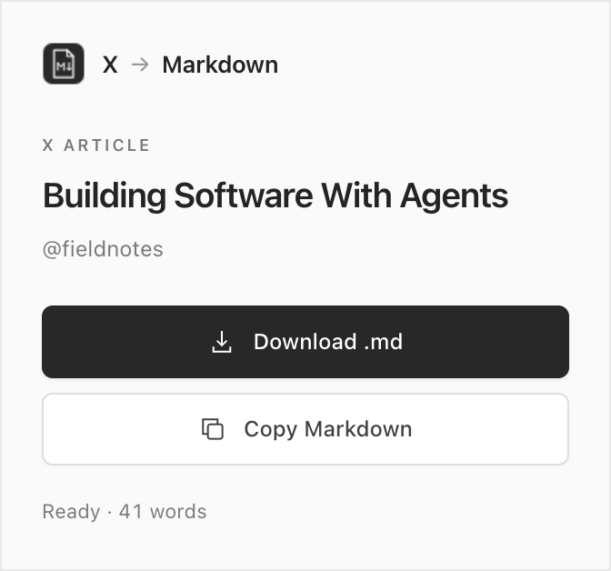

# X to Markdown

Save X Articles as clean Markdown in one click.

[Download the extension](https://github.com/mijomajic/x-to-md/releases/latest) · [Report a bug](https://github.com/mijomajic/x-to-md/issues)



Open an X Article, click the extension, and **download a `.md` file** or **copy the Markdown**. Free and open source. No account or setup beyond installing the extension.

## Features

- Article title, author, publication date, and source URL.
- Headings, bold, italics, links, lists, quotes, and code blocks.
- Cover images, inline images, captions, and links to embedded videos and posts.
- Emoji support and clean filenames based on the article title.

## Install

Available for Chrome, Brave, and other Chromium browsers. No terminal commands or build step required.

1. Open the [latest release](https://github.com/mijomajic/x-to-md/releases/latest) and download the **`x-to-md-…-chrome.zip`** file under **Assets**. Choose the extension ZIP, not a **Source code** archive.
2. Extract the ZIP into a folder you plan to keep.
3. Open `chrome://extensions` in Chrome, or `brave://extensions` in Brave.
4. Enable **Developer mode**, click **Load unpacked**, and select the extracted folder containing `manifest.json`.
5. Pin **X to Markdown** from the Extensions menu.

Keep the extracted folder in place while the extension is installed. The extension isn't on the Chrome Web Store yet.

To update, replace the contents of that folder with the new release and click **Reload** on the extension's card.

## Use

1. Open an X Article or the author's post that contains it.
2. Click **X to Markdown** in your browser toolbar.
3. Choose **Download .md** or **Copy Markdown**.

Files go to your browser's usual download location. You can paste the Markdown into Obsidian, a text editor, or any app that accepts Markdown.

## Supported articles

Works with `x.com/<username>/article/<id>` and `x.com/<username>/status/<id>` links when the post contains an Article, including equivalent `twitter.com` links. Ordinary posts and threads aren't supported.

If an `x.com/i/article/…` link or an older article fails, open the **author's post that shared the article** and try again. For connection errors, use **Retry** in the popup.

Extraction depends on the third-party FxTwitter API. Deleted, protected, restricted, or unavailable articles may not be accessible. Images remain remote URLs, so the Markdown file isn't an offline media archive. Videos and embedded posts are saved as links.

## CLI for agents

The CLI uses the same extraction and Markdown conversion as the extension. It needs
Node.js 22.12+ (22.x) or 24+, an internet connection, and no browser or X login.
From a clone of this repository:

```bash
npm install
npm link
x-to-md --help
```

Give an agent an X Article link and ask it to run:

```bash
x-to-md "https://x.com/author/status/123456789"
```

The full Markdown goes to stdout, so the agent can read it directly. To save files:

```bash
x-to-md "https://x.com/author/article/123456789" --output article.md
x-to-md --input links.txt --out-dir articles/
x-to-md "https://x.com/author/status/123" "https://x.com/author/status/456" --out-dir articles/
```

`links.txt` contains one URL per line; blank lines and lines starting with `#` are
ignored. Batch requests run sequentially, skip duplicate source URLs, and continue
after individual failures. Directory filenames include the title, URL kind, and
source ID. Existing files are never replaced unless you add `--force`. An explicit
`--output` requires its parent directory to exist; `--out-dir` creates directories.

Diagnostics and saved file paths go to stderr. Exit codes are `0` for success, `1`
for extraction or filesystem failures (including a partially successful batch),
and `2` for invalid arguments. The same article availability limits apply to the CLI.

Without installing a global command, use `npm run cli -- <url>` from this repository,
or build once with `npm run build:cli` and run `node /absolute/path/to/x-to-md/dist/cli.mjs <url>`
from any directory. After source changes, run `npm run build:cli` to update the linked CLI.
See [agent instructions](docs/agents.md) for a reusable prompt.

### Automatic agent skill

Install the discoverable Codex skill after installing the CLI:

```bash
npm run install:skill
```

This installs `read-x-articles` in `$CODEX_HOME/skills` (or `~/.codex/skills`),
with a fallback pointing to this checkout's executable. Open a new chat to make
the skill available for discovery. You can also invoke it explicitly with
`$read-x-articles`. The installer refuses to replace an existing skill; to update
your installed copy, run `npm run install:skill -- --force`.

### Structured output and content warnings

```bash
x-to-md --json "https://x.com/author/status/123456789"
x-to-md --json --input links.txt
x-to-md --json "https://x.com/author/status/123456789" --output article.json
```

`--json` emits one JSON object per line, so batches can be read directly without
saving files. Each object has `schemaVersion: 1` and `ok`. Successful results
contain `title`, `author`, `published`, `source`, `markdown`, `wordCount`, and
`warnings`; unknown authors and dates are `null`. Failures contain `source`
(or `null` for a command-level failure) and `error: { code, message, retryable }`.
Network errors, timeouts, and rate limits are retryable. Exit codes stay the same.

With `--output`, JSON is written to the specified file. With `--out-dir`, each
result is saved as a `.json` file and also emitted on stdout; saved results include
an absolute `savedPath`. Failures still emit JSON on stdout, including save failures.
`--help` always prints human-readable help.

Warnings have `code`, `message`, a zero-based `block` index, and optional `entity`
and `url`. Codes distinguish `unsupported-embed`, `missing-entity`,
`media-unavailable`, and `link-only`. Embedded posts and videos are preserved as
links and reported as such; their contents are not fetched or transcribed.
Unknown embeds retain available safe links and captions. Article dividers render
as Markdown rules. Human-readable warnings go to stderr even without `--json`,
and the extension shows the notice count with details on hover.

## Privacy

- No account, tracking, analytics, or backend operated by this project.
- Nothing is stored by the extension. Articles stay in memory until you close the popup; files and clipboard content are saved only when you request them.
- Extraction sends the article or post ID and, where available, the author's username to the [FxTwitter API](https://github.com/FixTweet/FxTwitter). FxTwitter also receives your IP address. Resolving an article link may request the author's article feed.
- Your X cookies, browsing history, and page contents aren't sent. Conversion to Markdown happens in your browser, but extraction isn't fully local.
- Opening the exported file in another app may load images from X's media servers.

## License

[MIT](LICENSE). [Third-party license notices](THIRD_PARTY_NOTICES.md) are included with the extension.

Independent project. Not affiliated with X Corp.
